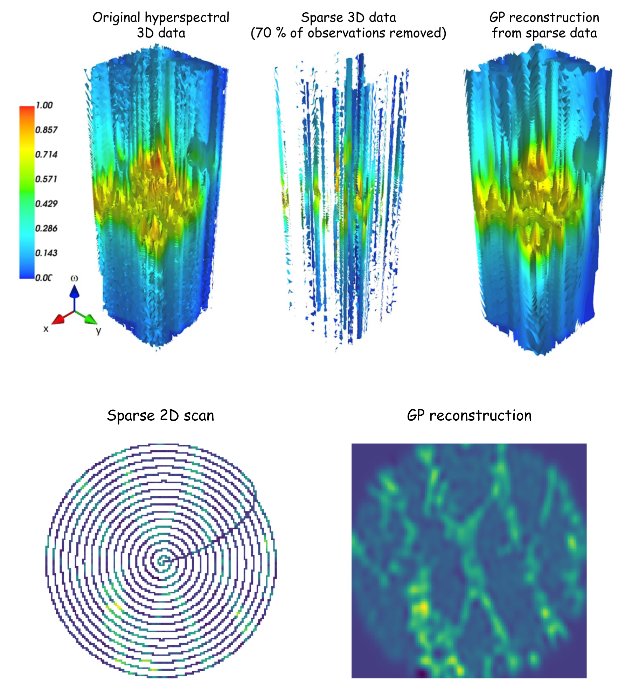

[](https://pepy.tech/project/gpim/month)
[](https://badge.fury.io/py/gpim)
[](https://travis-ci.com/ziatdinovmax/atomai)
[](https://gpim.readthedocs.io/en/latest/?badge=latest)
[](https://app.codacy.com/manual/ziatdinovmax/GPim?utm_source=github.com&utm_medium=referral&utm_content=ziatdinovmax/GPim&utm_campaign=Badge_Grade_Dashboard)

[](https://colab.research.google.com/github/ziatdinovmax/GPim/blob/master/examples/notebooks/Quickstart_GPim.ipynb)
[](https://gitpod.io/#https://github.com/ziatdinovmax/GPim)

**Under active development (expect some breaking changes)**

## What is GPim?

GPim is a python package that provides an easy way to apply Gaussian processes (GP) in [Pyro](https://pyro.ai/) and [Gpytorch](https://gpytorch.ai/) to images and hyperspectral data and to perform GP-based Bayesian optimization on grid data. The intended audience are domain scientists (for example, microscopists) with a basic knowledge of how to work with numpy arrays in Python.
<br><br>
For the examples, see the papers where GPim was used:

- GP for 3D hyperspectral microscopy data: [paper](https://arxiv.org/abs/1911.11348)

- GP for 4D hyperspectral microscopy data: [paper](https://arxiv.org/abs/2002.03591)

- GP and GP-based BO for Ising model: [paper](https://arxiv.org/abs/2004.04832)

- GP-based BO for hysteresis loop engineering in ferroelectrics: [paper](https://arxiv.org/abs/2004.12512)
 
<p align="center">
  
<p align="justify">

## Installation

First install [PyTorch](https://pytorch.org/). Then install GPim using

```bash
pip install gpim
```


## How to use

### GP reconstruction

Below is a simple example of applying GPim to reconstructing a sparse 2D image. It can be similarly applied to 3D and 4D hyperspectral data. The missing data points in sparse data must be represented as [NaNs](https://docs.scipy.org/doc/numpy/reference/constants.html?highlight=numpy%20nan#numpy.nan). In the absense of missing observation GPim can be used for image and spectroscopic data cleaning/smoothing in all the dimensions simultaneously, as well as for the resolution enhancement.

```python
import gpim
import numpy as np

# # Load dataset
R = np.load('sparse_exp_data.npy') 

# Get full (ideal) grid indices
X_full = gpim.utils.get_full_grid(R, dense_x=1)
# Get sparse grid indices
X_sparse = gpim.utils.get_sparse_grid(R)
# Kernel lengthscale constraints (optional)
lmin, lmax = 1., 4.
lscale = [[lmin, lmin], [lmax, lmax]] 

# Run GP reconstruction to obtain mean prediction and uncertainty for each predictied point
mean, sd, hyperparams = gpim.reconstructor(
    X_sparse, R, X_full, lengthscale=lscale,
    learning_rate=0.1, iterations=250, 
    use_gpu=True, verbose=False).run()

# Plot reconstruction results
gpim.utils.plot_reconstructed_data2d(R, mean, cmap='jet')
# Plot evolution of kernel hyperparameters during training
gpim.utils.plot_kernel_hyperparams(hyperparams)
```

### GP-based Bayesian optimization
When performing measurements (real or simulated), one can use the information about the expected function value and uncertainty in GP reconstruction to select the next measurement point. This is usually referred to as exploration-exploitation approach in the context of Bayesian optimization. A simple example with a "dummy" function is shown below.

```python
import gpim
import numpy as np
np.random.seed(42)

# Create a dummy 2D function
def trial_func(idx):
    """Takes a list of indices as input and returns function value at these indices"""
    return np.exp(-4*np.log(2) * ((idx[0]-5)**2 + (idx[1]-10)**2) / 4.5**2) 

# Create an empty observation matrix
grid_size = 25
Z_sparse = np.ones((grid_size, grid_size)) * np.nan
# Seed it with several random observations
idx = np.random.randint(0, grid_size, size=(4, 2))
for i in idx:
    Z_sparse[tuple(i)] = trial_func(i) 

# Get full and sparse grid indices for GP
X_full = gpim.utils.get_full_grid(Z_sparse)
X_sparse= gpim.utils.get_sparse_grid(Z_sparse)
# Initialize Bayesian optimizer with an 'expected improvement' acquisition function
boptim = gpim.boptimizer(
    X_sparse, Z_sparse, X_full, 
    trial_func, acquisition_function='ei',
    exploration_steps=30,
    use_gpu=False, verbose=1)
# Run Bayesian optimization
boptim.run()

# Plot exploration history
gpim.utils.plot_query_points(boptim.indices_all, plot_lines=True)
```

## Running GPim notebooks in the cloud

1) Executable Google Colab [notebook](https://colab.research.google.com/github/ziatdinovmax/GPim/blob/master/examples/notebooks/GP_2D3D_images.ipynb) with the examples of applying GP to sparse spiral 2D scans in piezoresponse force microscopy (PFM), simulated 2D atomic image in electron microscopy, and hyperspectral 3D data in Band Excitation PFM.
2) Executable Google Colab [notebook](https://colab.research.google.com/github/ziatdinovmax/GPim/blob/master/examples/notebooks/GP_EELS.ipynb) with the example of applying "parallel" GP method to analysis of EELS data.
3) Executable Google Colab [notebook](https://colab.research.google.com/github/ziatdinovmax/GPim/blob/master/examples/notebooks/GP_TD_cKPFM.ipynb) with the example of applying GP to 4D spectroscopic dataset for smoothing and resolution enhancement in contact Kelvin Probe Force Microscopy (cKPFM).
4) Executable Google Colab [notebook](https://colab.research.google.com/github/ziatdinovmax/GPim/blob/master/examples/notebooks/GP_based_exploration_exploitation.ipynb) with a simple example of performing GP-based exploration-exploitation on a toy dataset.

## Requirements

It is strongly recommended to run the codes with a GPU hardware accelerator (such as NVIDIA's P100 or V100 GPU). If you don't have a GPU on your local machine, you may rent a cloud GPU from [Google Cloud AI Platform](https://cloud.google.com/deep-learning-vm/). Running the [example notebooks](https://colab.research.google.com/github/ziatdinovmax/GPim/blob/master/examples/notebooks/Quickstart_GPim.ipynb) one time from top to bottom will cost about 1 USD with a standard deep learning VM instance (one P100 GPU and 15 GB of RAM).
